# Kubernetes Simulator

A Go CLI and web GUI for practicing Certified Kubernetes Administrator (CKA) exam scenarios against a real or simulated cluster.

> Inject faults, repair workloads, get graded. No cloud account required.

---

## 📊 Presentation

A short deck on Kubernetes fundamentals and how this simulator teaches them through the **inject → inspect → repair → grade** loop.

[**Full deck (PDF)**](presentation/Kubernetes-CKA-Simulator.pdf) · [**Editable slides (PPTX)**](presentation/Kubernetes-CKA-Simulator.pptx)

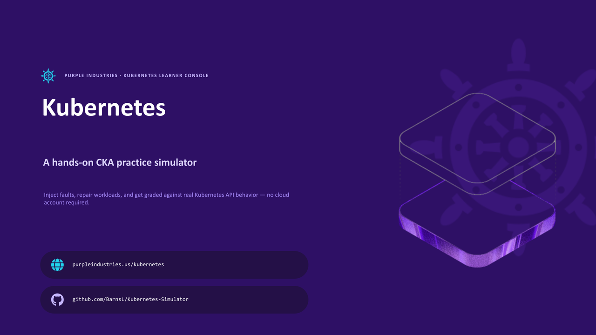

<details>
<summary><b>View all 13 slides</b></summary>

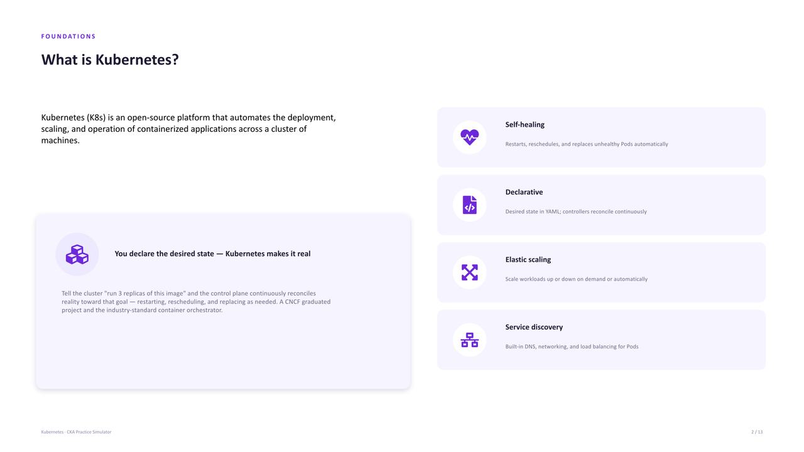
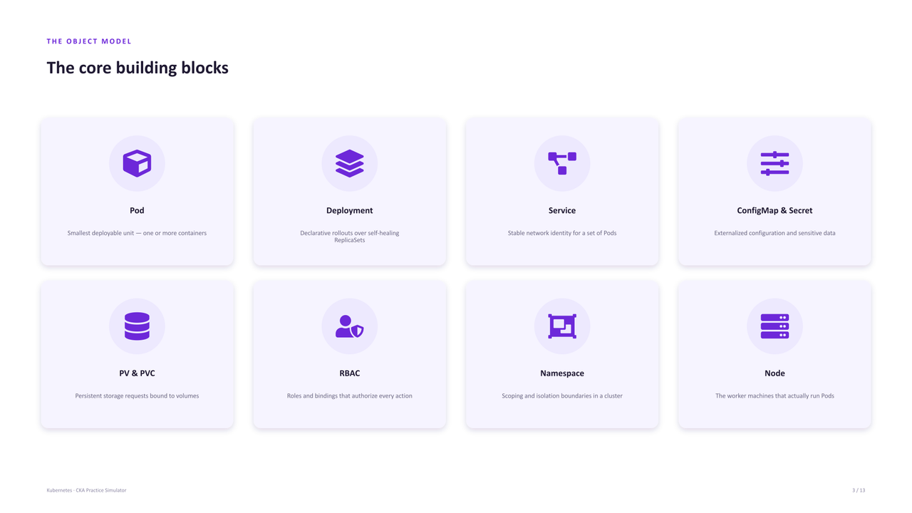
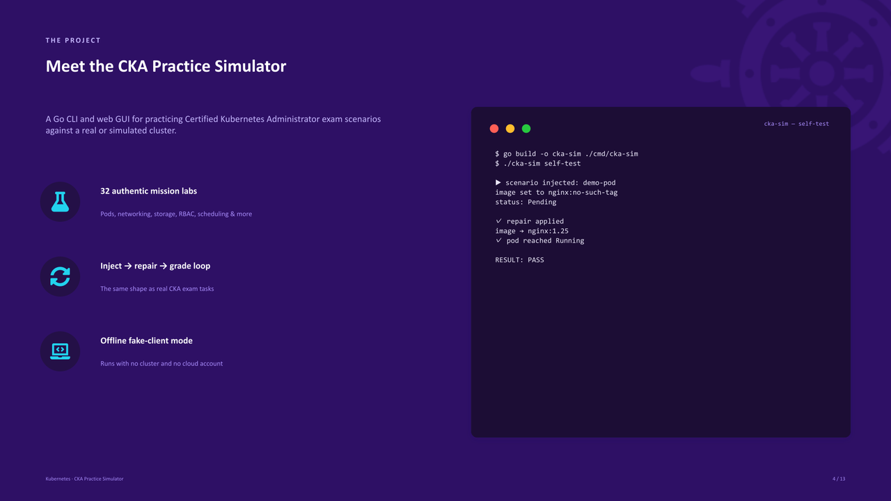
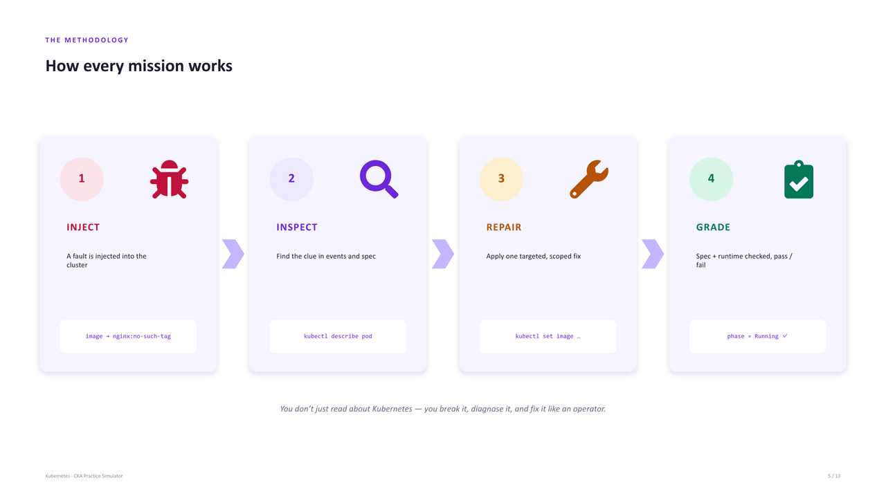
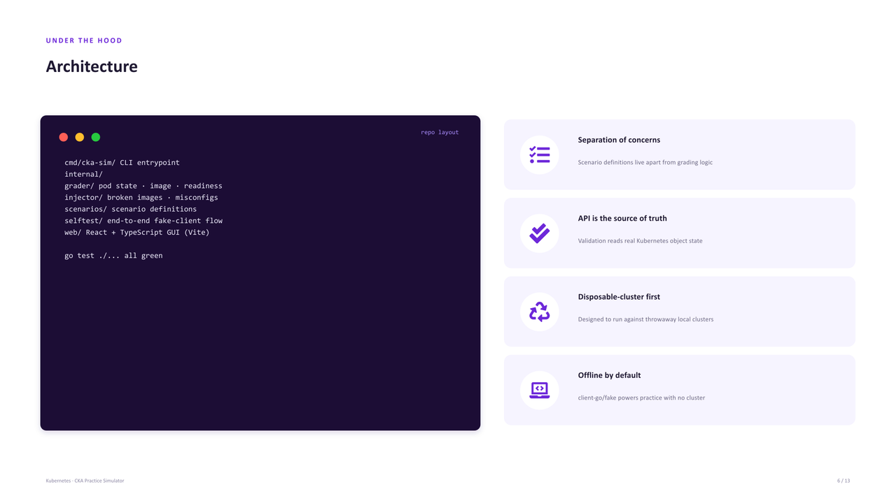
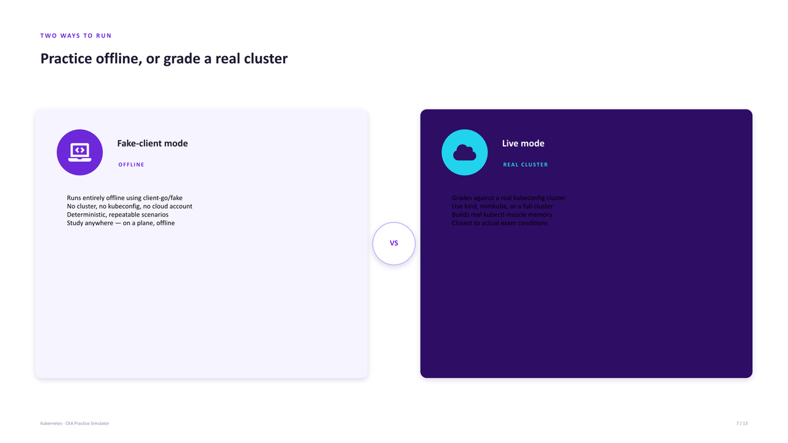
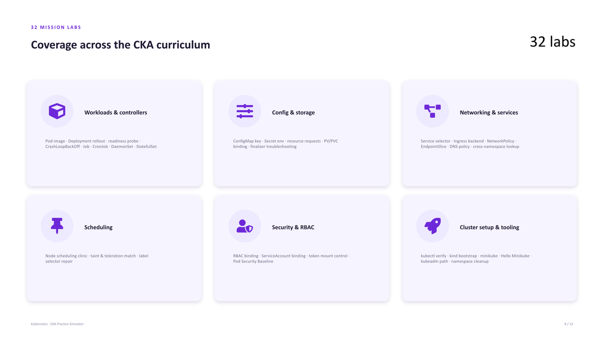
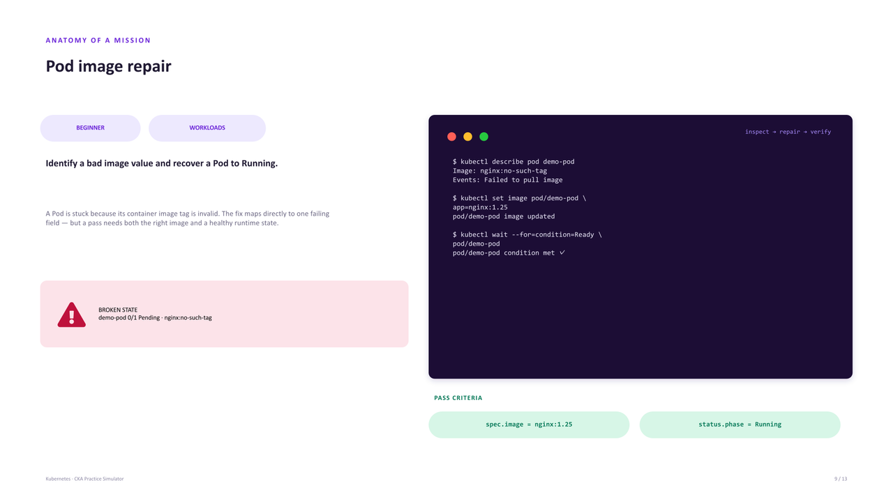
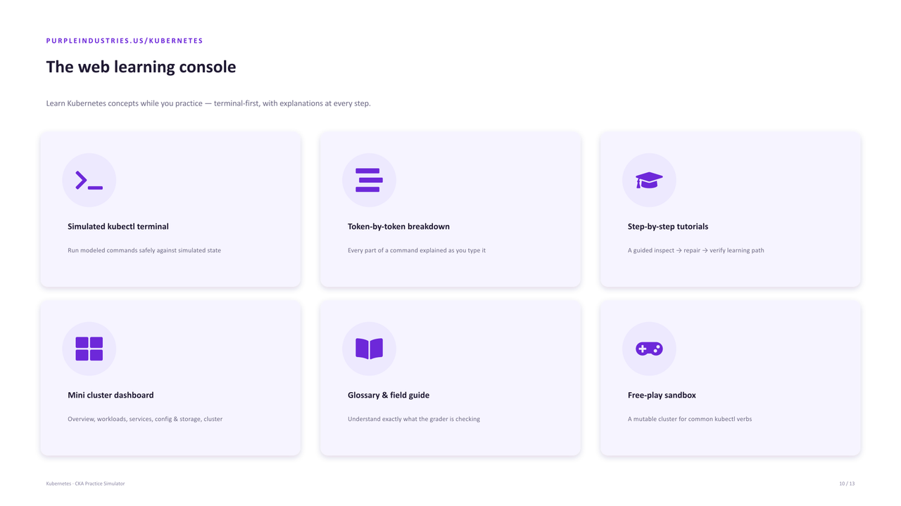
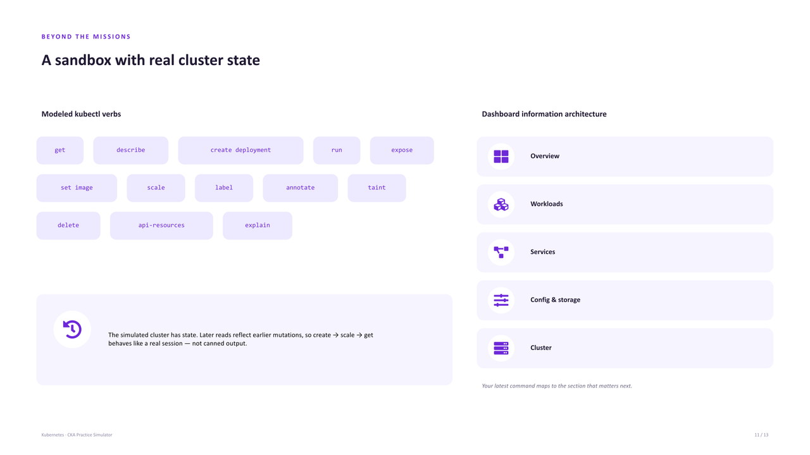
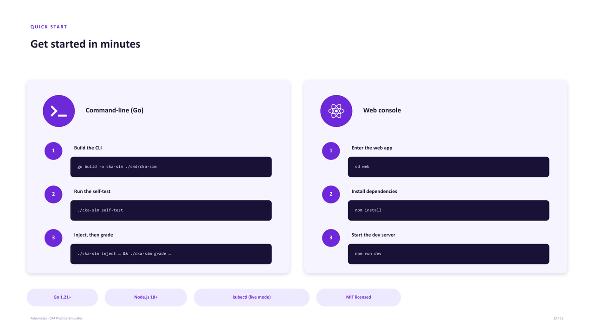
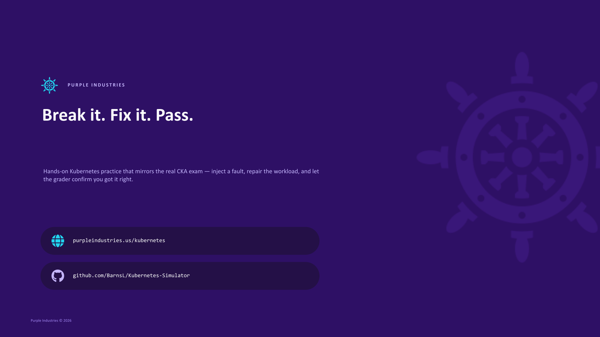

</details>

---

## Features

- **32 mission labs** covering pods, deployments, RBAC, networking, storage, scheduling, and more
- **Inject → Repair → Grade loop** that mirrors real CKA exam tasks
- **Fake-client mode:** runs entirely offline using `client-go/fake` (no cluster needed)
- **Live mode:** grades against a real kubeconfig-connected cluster
- **Web GUI** with simulated kubectl terminal, step-by-step tutorials, visual dashboard, and free-play sandbox
- **Self-test command** for quick validation without any external dependencies

---

## Quick Start

```bash
# Build the CLI
go build -o cka-sim ./cmd/cka-sim

# Run the built-in self-test (no cluster required)
./cka-sim self-test

# Or inject a fault and grade the repair
./cka-sim inject --namespace default --pod nginx-pod --broken-image nginx:no-such-tag
# ... fix the pod ...
./cka-sim grade --namespace default --pod nginx-pod --image nginx:1.25
```

### Web GUI

```bash
cd web
npm install
npm run dev
```

---

## Architecture

```
cmd/cka-sim/         CLI entrypoint
internal/
  grader/            Grading logic (checks pod state, image, readiness)
  injector/          Fault injection (broken images, misconfigs)
  scenarios/         Scenario definitions
  selftest/          End-to-end fake-client test flow
web/                 React + TypeScript learning GUI (Vite)
```

---

## Mission Labs (32)

Pod image repair · Node scheduling clinic · PV binding workshop · RBAC access mission · Deployment rollout recovery · Readiness probe repair · ConfigMap key correction · Secret environment repair · Service selector mismatch · Ingress backend correction · CrashLoopBackOff arguments · Taint and toleration match · Namespace context cleanup · Job completion repair · CronJob schedule correction · NetworkPolicy access restore · Resource request tuning · ServiceAccount binding repair · DaemonSet image repair · StatefulSet service wiring · Label selector repair · Cross-namespace service lookup · Finalizer troubleshooting · EndpointSlice readiness review · Pod DNS policy fix · Pod Security Baseline review · ServiceAccount token mount control · kubectl client verification · kind cluster bootstrap · minikube startup verification · Hello Minikube deployment · kubeadm learning path choice

---

## Prerequisites

- Go 1.21+
- Node.js 18+ (for the web GUI)
- `kubectl` configured (live mode only)

## Test

```bash
go test ./...
```

---

## References

- [Kubernetes API overview](https://kubernetes.io/docs/reference/using-api/)
- [client-go](https://github.com/kubernetes/client-go)
- [CKA Exam Curriculum](https://github.com/cncf/curriculum)

---

## License

MIT
